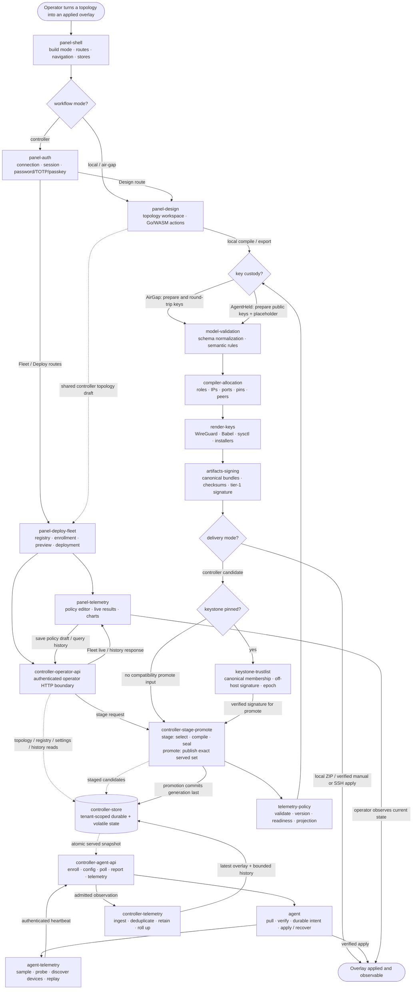

# specs/ — yet-another-overlay-generator (YAOG)

<!-- regenerated: 2026-07-17 -->
<!-- by: refresh-specs -->

This directory is the cached architectural ground truth for YAOG, a Go control plane and compiler
with a React/Vite panel. It is partial-loaded by `execute-implementation-plan` through a plan's
`Reads from specs:` header and audited by `close-phase` at closure boundaries. The maintained
deep-detail documentation remains under `docs/spec/`; live code and these component maps win if a
deeper document has drifted.

## How to read this

| If you want to... | Read |
|---|---|
| Get oriented as a new contributor | This file's diagram, then the components your work touches |
| Understand a specific subsystem | `specs/<component>.md` for that subsystem |
| See current open work or blockers | `STATUS.md` at repository root |
| See project-wide invariants | `PRINCIPLES.md` at repository root |
| See how to build, run, or operate YAOG | `README.md` and `docs/wiki.md` |
| Go deeper than a component map | `docs/spec/`, cross-checking architectural claims against current code |

## Primary operation diagram

**Lifecycle:** operator starts with a topology and ends with a locally or controller-delivered overlay
whose current state is observable. The structural branches are workflow mode, key custody, delivery
mode, and the optional keystone gate. Controller stage first builds and seals the candidate; the same
component is re-entered for promotion only after any required keystone signature is installed. In the
shared compile path, custody selection and key preparation happen before schema/compiler work; text
rendering happens after compiler derivation.

## Components — when to read which

| Component | Read when... | File |
|---|---|---|
| Panel shell | Touching build modes, routes, navigation, store boundaries, i18n, or appearance | [`panel-shell.md`](panel-shell.md) |
| Panel auth | Touching controller connection, sessions, password/TOTP/passkey login, or browser credential enrollment | [`panel-auth.md`](panel-auth.md) |
| Panel design | Touching the canvas, topology store, import/export, local persistence, or Go/WASM actions | [`panel-design.md`](panel-design.md) |
| Panel deploy and Fleet | Touching registry/enrollment, deploy preview, stage/sign/promote orchestration, or Live refresh | [`panel-deploy-fleet.md`](panel-deploy-fleet.md) |
| Panel telemetry | Touching active-check/device policy UI, live probe/device results, history selectors, or charts | [`panel-telemetry.md`](panel-telemetry.md) |
| Model validation | Touching topology DTOs, schema defaults, semantic rules, roles, or Go/TypeScript wire drift | [`model-validation.md`](model-validation.md) |
| Compiler and allocation | Touching role inference, peer derivation, overlay/transit/link-local allocation, ports, or sticky pins | [`compiler-allocation.md`](compiler-allocation.md) |
| Render and key custody | Touching AirGap/AgentHeld keys, config/script rendering, private-key splice, or deploy helpers | [`render-keys.md`](render-keys.md) |
| Artifacts and signing | Touching bundle membership, filesystem export, checksums, tier-1 signing, or pre-apply integrity | [`artifacts-signing.md`](artifacts-signing.md) |
| Telemetry policy | Touching ICMP/TCP/URL policy, automatic-device mode, policy versions, or rollout readiness | [`telemetry-policy.md`](telemetry-policy.md) |
| Controller store | Touching persistence contracts, FileStore/MemStore parity, filesystem custody, audit, or generic history storage | [`controller-store.md`](controller-store.md) |
| Controller stage/promote | Touching deployment-ready subgraphs, delta stage, candidate seals, allocation writeback, or promotion recovery | [`controller-stage-promote.md`](controller-stage-promote.md) |
| Controller operator API | Touching operator listener routes, session/break-glass auth, CSRF/CORS, typed errors, or API cache policy | [`controller-operator-api.md`](controller-operator-api.md) |
| Controller agent API | Touching node enrollment, bearer auth, config/poll/report/telemetry/rekey, or bootstrap | [`controller-agent-api.md`](controller-agent-api.md) |
| Keystone trust list | Touching membership manifests, browser/raw signing, credential transitions, epoch, or node membership verification | [`keystone-trustlist.md`](keystone-trustlist.md) |
| Node agent | Touching node key/state custody, polling, verification, apply/uninstall, recovery, or self-update | [`agent.md`](agent.md) |
| Agent telemetry | Touching sampling/upload cadence, active probes, device discovery, GPU/disk/filesystem collection, or replay | [`agent-telemetry.md`](agent-telemetry.md) |
| Controller telemetry | Touching live ingestion, reliable receipts, deduplication, metric catalog, retention, filtering, or rollups | [`controller-telemetry.md`](controller-telemetry.md) |

## Glossary (domain vocabulary used in the diagram)

| Term | Meaning |
|---|---|
| Topology | Editable project, domain, node, edge, and active-telemetry intent; route policy is reserved and must remain empty |
| Domain | Overlay address/routing scope to which nodes belong |
| Allocation pin | Compiler-written port, transit IP, or link-local field persisted so recompiles stay stable |
| AirGap custody | Offline/local mode in which private keys round-trip with operator-owned topology state |
| AgentHeld custody | Controller mode in which the node retains its private key and rendered configs carry a placeholder |
| Bundle | One node's checksummed configuration, policy, installer, and optional tier-1 signature files |
| Deployment-ready | A managed enrolled node or valid manual node eligible for the controller subgraph |
| Stage / promote | Build and seal the next exact candidate set, then publish it as one recoverable generation transition |
| Generation | Monotonic controller deployment cursor used by agents for long-poll convergence |
| Keystone | Optional operator-controlled public credential whose off-host signature authorizes exact membership |
| Trust list | Canonical signed members: node ID, WireGuard public key, bundle digest, and monotonic epoch |
| Active probe | Typed, bounded node policy for ICMP, TCP, or URL observation; not an arbitrary command surface |
| Telemetry protocol v2 | Header-only reliable delivery extension that preserves the legacy JSON heartbeat body |
| Metric catalog | Shared registry declaring each production metric charted or live-only and its chart family |

## Cross-doc map

- `STATUS.md` — active subjects, current plan, blockers, and next action; regenerated at closure.
- `README.md` — user/developer entry point and build/run guidance.
- `PRINCIPLES.md` — minimal project-wide invariants that implementation plans must preserve.
- `CLAUDE.md` and ignored local `AGENTS.md` — synchronized coding-agent guidance.
- `docs/spec/` — maintained deep contracts and operational detail; component files provide the
  architectural navigation layer.
- `docs/wiki.md` and `docs/wiki-zh.md` — user-facing English and Chinese manuals.

---

*Generated by `refresh-specs` on 2026-07-17. Regenerate via `$refresh-specs`. Per-component touch-ups
happen through `close-phase`.*
