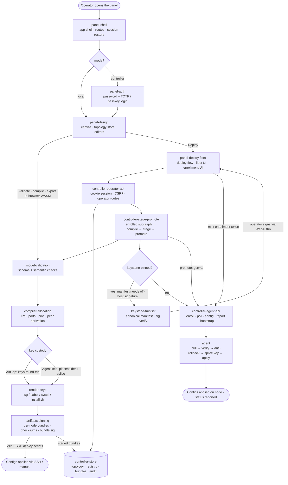

# specs/ — yet-another-overlay-generator (YAOG)

<!-- regenerated: 2026-06-12 -->
<!-- by: refresh-specs -->

This directory is the cached architectural ground truth for **YAOG**, a
WireGuard + Babel overlay-network generator with two operating modes:
**local/air-gap** (design in the browser, export per-node bundles) and
**controller** (a long-lived Docker control plane from which enrolled node
agents pull keystone-signed configs). It is partial-loaded by
execute-implementation-plan (per a plan file's `Reads from specs:` header)
and audited by close-phase at every closure boundary.

## How to read this

| If you want to... | Read |
|---|---|
| Get oriented as a new contributor | This file's diagram + the components your work touches |
| Understand a specific subsystem | `specs/<component>.md` for that subsystem |
| See current open work / blockers | `STATUS.md` at repo root |
| See project-wide invariants | `PRINCIPLES.md` at repo root |
| See how to run / use the project | `README.md` at repo root |
| Go deeper than a component file | `docs/spec/` — the maintained deep-doc layer (cited per component; verify drift-flagged claims against code) |

## Primary operation diagram

**Lifecycle:** Operator opens the panel → configs applied (via SSH/manual
export in local mode; via verified agent pull in controller mode). The two
structural decision points are the **mode split** (local vs controller) and
the **key-custody split** (AirGap: keys round-trip to the browser; AgentHeld:
zero-knowledge placeholder spliced with the node's locally-held key).

## Components — when to read which

| Component | Read when... | File |
|---|---|---|
| panel-shell | Touching routes, theming, i18n, nav, session-restore-on-mount | `panel-shell.md` |
| panel-auth | Touching login flows (password/TOTP/passkey), client session/CSRF state | `panel-auth.md` |
| panel-design | Touching the canvas, topology store, localStorage persistence, import/export | `panel-design.md` |
| panel-deploy-fleet | Touching the deploy flow, fleet UI, enrollment UI, connection/bootstrap settings | `panel-deploy-fleet.md` |
| model-validation | Touching the topology model or validation rules | `model-validation.md` |
| compiler-allocation | Touching IP/port allocation, pins, stability, peer derivation | `compiler-allocation.md` |
| render-keys | Touching key generation/custody or config/script rendering | `render-keys.md` |
| artifacts-signing | Touching bundle layout, checksums, or Ed25519 bundle signing | `artifacts-signing.md` |
| controller-store | Touching persistence, tenant scoping, generations, audit | `controller-store.md` |
| controller-stage-promote | Touching the enrolled-subgraph compile, stage/promote semantics | `controller-stage-promote.md` |
| controller-operator-api | Touching operator routes, cookie/CSRF/CORS, path prefix | `controller-operator-api.md` |
| controller-agent-api | Touching agent routes, enrollment tokens, long-poll, bootstrap installer | `controller-agent-api.md` |
| keystone-trustlist | Touching the off-host signing ceremony, trust-list, membership verification | `keystone-trustlist.md` |
| agent | Touching the node agent (keygen/enroll/apply cycle, verification, state) | `agent.md` |

## Glossary (domain vocabulary used in the diagram)

| Term | Meaning |
|---|---|
| Topology | The editable design graph: project + domains + nodes + edges |
| Domain | A logical IP domain (CIDR) nodes belong to |
| Allocation pins | Compiler-written fields (IPs/ports) persisted into the topology so re-compiles stay stable |
| Custody (AirGap / AgentHeld) | Who holds WG private keys: round-tripped to the operator (local) vs generated and held only on the node (controller) |
| Bundle | Per-node artifact set: wireguard/babel/sysctl configs + install.sh + checksums (+ optional signature) |
| Generation | Monotonic deploy counter per tenant; agents poll for generations newer than their cursor |
| Stage / Promote | Stage compiles enrolled nodes into staged bundles; promote atomically flips staged→current and bumps the generation |
| Enrollment | One-time ceremony binding a machine to a design node ID via a single-use token, yielding a per-node bearer token |
| Keystone | The operator-held signing credential (browser WebAuthn or raw Ed25519 CLI); when pinned, promote requires a valid trust-list signature. The controller stores public material only, and does not attest WebAuthn hardware backing or non-exportability |
| Trust-list | Canonical signed manifest of approved members (node ID + WG pubkey + bundle checksum), verified by agents before apply |
| Operator | The human controlling the panel (password/TOTP/passkey login) |
| Tenant | The single state scope a controller serves (`YAOG_TENANT_ID`) |
| Secret path prefix | Optional per-audience path segment the controller routes mount under: `YAOG_OPERATOR_PATH_PREFIX` (operator/panel port) and `YAOG_AGENT_PATH_PREFIX` (agent port), independently |

## Cross-doc map

- `STATUS.md` — what's active right now (regenerated at every closure).
- `README.md` — how to use the project; referentially comprehensive.
- `PRINCIPLES.md` — domain invariants (the rules; never violate).
- `docs/spec/` — the maintained deep-doc layer (controller/, compiler/,
  data-model/, api/, operations/). Kept live by decision (2026-06-12);
  component files cite it for depth. **Known drift:** persistence.md's
  "public-keys-only store" claim is a caller contract, not store-enforced —
  see `controller-store.md` Invariants.
- `docs/wiki.md` / `docs/wiki-zh.md` — user-facing documentation.

---

*Generated by `refresh-specs` on 2026-06-12. Regenerate via
`/refresh-specs`. Per-component touch-ups happen via close-phase Step 4.6.*
